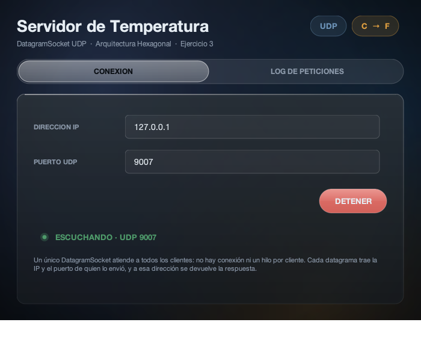
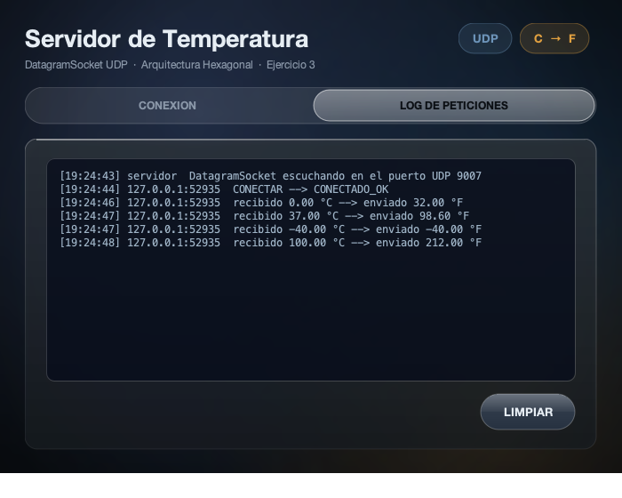
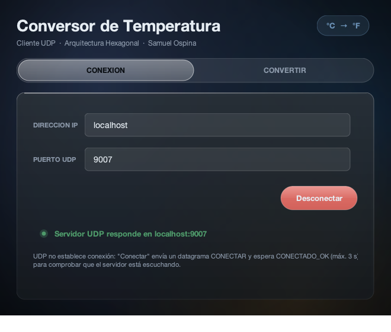
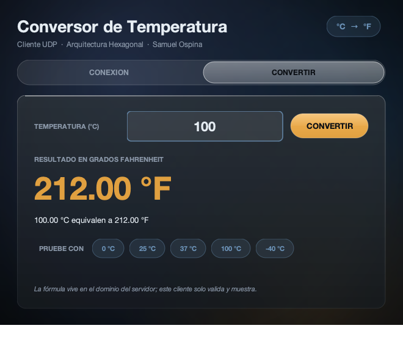

# Ejercicio 3: Conversión de temperatura con UDP/IP y Arquitectura Hexagonal

Autor: **Samuel David Ospina De Avila** · Sistemas Distribuidos, 2º corte

**▶ Video de sustentación:** https://youtu.be/GM3t-wxDVNw

Es el mismo ejercicio del 1er corte (convertir grados **Celsius** a **Fahrenheit**), rehecho con:

- **UDP/IP** (`DatagramSocket` / `DatagramPacket`) en lugar de TCP (`ServerSocket` / `Socket`).
- **Arquitectura Hexagonal** (puertos y adaptadores), con la misma estructura de los repositorios
  guía [`imc-udp-server-java-hexagonal`](https://github.com/arrietajohn/imc-udp-server-java-hexagonal) y
  [`imc-udp-client-java-hexagonal`](https://github.com/arrietajohn/imc-udp-client-java-hexagonal).

La fórmula `F = C × 9/5 + 32` está **solo** en el dominio del servidor
(`dominio/modelos/Conversion.java`). El cliente valida el dato, lo envía y muestra la respuesta.

## Vistas

| Servidor escuchando | Log de peticiones |
|---|---|
|  |  |
| **Cliente conectado** | **Cliente convirtiendo** |
|  |  |

## Cómo ejecutar

Requisito: **Java 17 o superior**. No hace falta instalar Maven porque cada proyecto trae el Maven Wrapper (`mvnw`).

```bash
# Terminal 1: servidor
cd temperatura-udp-server
./mvnw package            # compila y corre las pruebas
java -jar target/temperatura-udp-server.jar

# Terminal 2: cliente
cd temperatura-udp-client
./mvnw package
java -jar target/temperatura-udp-client.jar
```

En Windows se usa `mvnw.cmd package`. En el servidor presione **INICIAR** (puerto 9007). En el
cliente presione **Conectar** (`localhost`, `9007`), escriba una temperatura y **CONVERTIR**.

## Protocolo (texto UTF-8, un datagrama por mensaje)

| Cliente envía | Servidor responde |
|---|---|
| `CONECTAR` | `CONECTADO_OK;Servidor UDP listo para convertir temperaturas` |
| `CONVERTIR;100.00` | `OK_CONVERSION;100.00;212.00` |
| `CONVERTIR;-300` | `ERROR;No existen temperaturas por debajo del cero absoluto (-273.15 °C).` |
| `DESCONECTAR` | `DESCONECTADO_OK;Sesión finalizada` |

## TCP (1er corte) vs UDP (este taller)

| | TCP | UDP |
|---|---|---|
| Conexión | `Socket` establece conexión (3-way handshake) | No hay conexión: cada datagrama es independiente |
| Servidor | `ServerSocket.accept()` + **un hilo por cliente** | **Un solo** `DatagramSocket` y un hilo que hace `receive()` para todos |
| ¿A quién respondo? | Al flujo del socket de ese cliente | A la IP y el puerto que vienen **dentro del paquete** (`getAddress()`, `getPort()`) |
| Entrega | Garantizada y en orden | No garantizada, por eso el cliente usa `setSoTimeout(3000)` |
| "Conectar" | Real | Un saludo `CONECTAR → CONECTADO_OK` para comprobar que el servidor está vivo |

## Arquitectura hexagonal

```
                  ┌──────────────────────── NÚCLEO ────────────────────────┐
  ENTRYPOINTS     │  aplicacion/                    dominio/               │   ADAPTADORES DE SALIDA
  (adapt. entrada)│  puertos/entrada  ◄── servicios ──►  puertos/salida    │
  gui/ServidorFrame ─► GestionarServidorInputPort      ControladorServidorRedPort ◄── AdaptadorControlServidorRed
  udp/Receptor... ───► ProcesarPeticionUdpInputPort    PuertoSalidaRed ◄────────────── AdaptadorSalidaUdp ─► CanalUdp
                  │                     Conversion      PuertoNotificacionEvento ◄──── AdaptadorNotificacionEvento ─► GUI
                  │                  (F = C·9/5+32)                        │
                  └────────────────────────────────────────────────────────┘
```

- **dominio/**: reglas del negocio, sin librerías de red ni Swing. Value objects (`Celsius` rechaza
  valores por debajo de -273.15), la entidad `Conversion` y las interfaces de los puertos de salida.
- **aplicacion/**: casos de uso (`ProcesarPeticionUdpService`, `GestionarServidorService`,
  `ClienteTemperaturaService`), sus puertos de entrada, DTOs y mappers.
- **adaptadores/**: implementan los puertos de salida con UDP (`CanalUdp`, `AdaptadorSalidaUdp`,
  `AdaptadorClienteUdp`) y traducen al protocolo de texto (`UdpNetworkMapper`, `ProtocoloUdpMapper`).
- **entrypoint/**: por dónde entra el mundo: la GUI y el receptor de datagramas.
- **Main**: *composition root*, el único lugar que instancia clases concretas y las conecta.

Las dependencias apuntan hacia adentro: el dominio no importa nada de afuera. Por eso cambiar TCP
por UDP solo toca adaptadores y entrypoints; `Conversion` es la misma lógica del 1er corte.

## Pruebas

```bash
./mvnw test
```

- Servidor (14): fórmula y cero absoluto, caso de uso con puertos falsos (sin red) e integración
  con datagramas reales en localhost.
- Cliente (5): protocolo, validación de entradas, integración contra un servidor UDP falso y
  timeout cuando nadie responde.
